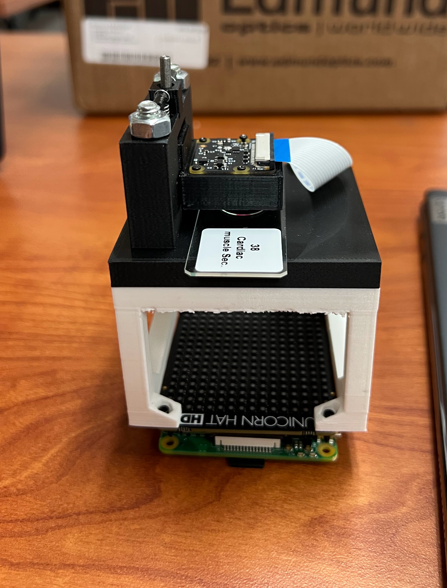

We aim to utilize Fourier ptychography (FP) techniques for microscopy in novel ways. We have finished building a [low-cost setup](https://www.nature.com/articles/s41598-019-43845-9){:target="_blank" :rel="noopener noreferrer"} for FP microscopy and written an algorithm for reconstruction on data gathered from our setup. We are now advancing to run experiments on our setup. We aim to, among other ideas, develop an enhancement algorithm that can yield similar results to more expensive FP setups at a lower cost.

This project is currently in progress, and thus I will not post any code/methods. However, please reach out if you would like to learn more.

<!--  -->

