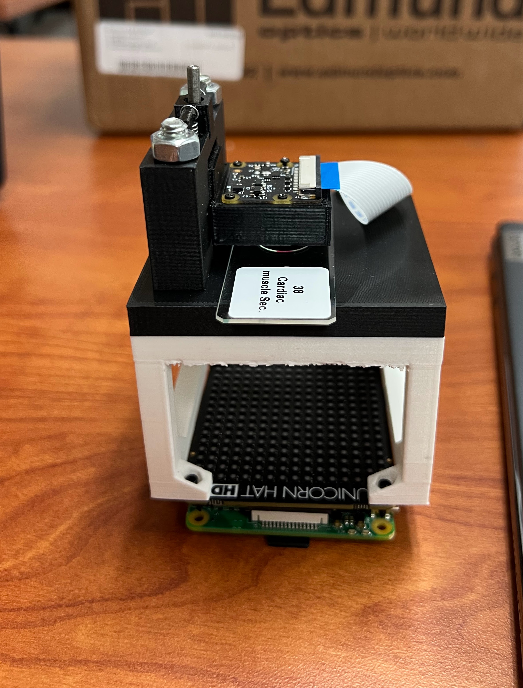

Poster presented at ICCP 2026. Abstract:

Fourier ptychography (FP) is a synthetic aperture technique where samples are illuminated at differing angles to broaden the range of frequencies in a reconstructed image. It is widely used in biomedical imaging applications for super-resolution of microscopic samples. Conventional setups require a large light or sensor array and dozens to hundreds of measurements for a high-quality reconstruction. We present a novel method of conducting Fourier ptychography that incorporates a slit aperture. Through the use of different movements of the aperture, we produce comparable results to conventional FP while significantly reducing the number of required measurements. We utilize translation of the slit aperture to super-resolve high frequency signals of the illuminated object, allowing us to achieve a quadratic reduction in the number of measurements required for reconstruction. We separately utilize rotation of the slit aperture to sample high frequency components within reach of the slit without needing the conventional translation of FP, only requiring space for the slit to rotate around its center. Our methods improve the feasibility of FP in constrained systems such as periscopic cell phone imaging that only have freedom along one axis or satellite imaging where large sensors are expensive to transport.

<!--  -->

