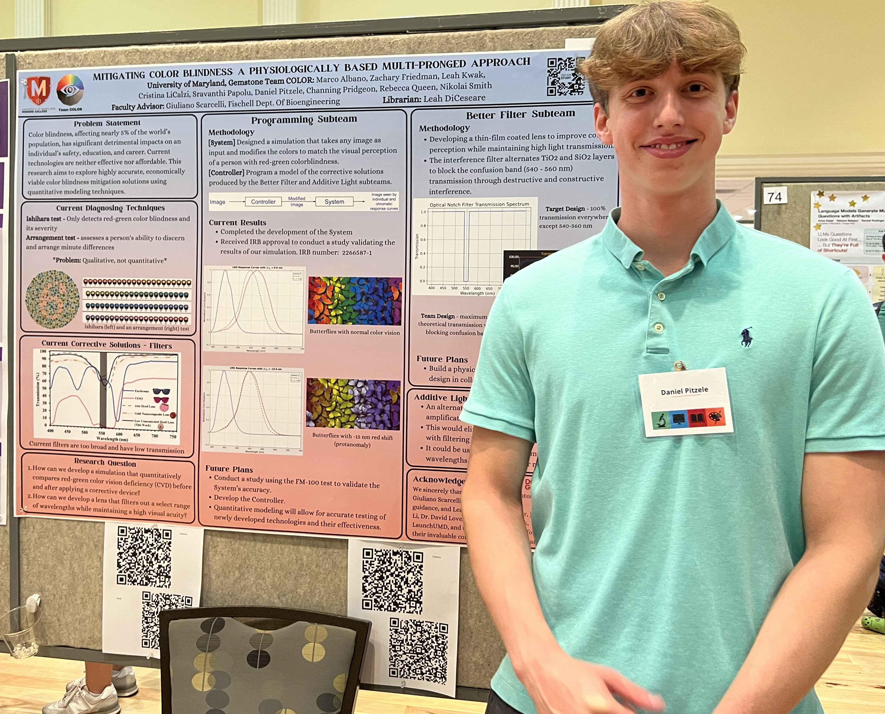

I was a member of an undergraduate research team called Team COLOR. Our overarching goal was to contribute to a practical and accessible mitigation solution for color blindness. Our team is a part of the Gemstone honors program at UMD. In the program, undergraduates form teams and lead their research while being advised by mentors that are experts in their respective fields.

On this team, I am a major contributor to the programming subsection of our work. We created a physiologically-based simulation, roughly based on [this paper](https://ieeexplore.ieee.org/document/5290741){:target="_blank" :rel="noopener noreferrer"}, of how someone with color blindness sees the world. The simulation allows us to model various different versions (strengths) of anomalous trichromacy, specifically red-green color blindness. In the future, it could also be used to validate the efficacy of potential migitation solutions for these types of color blindness. [Our codebase](https://github.com/djpitzele/Team-COLOR-Sim){:target="_blank" :rel="noopener noreferrer"} is publicly available.

Throughout our research, our team has had multiple opportunities to present our work. I was the main presenter in our talk at Gemstone's Do Good showcase, an opportunity for each junior team to discuss their research progress. This presentation culminated with our team winning a financial award that we applied to further research. We also presented a poster at UMD's Undergraduate Research Day 2025.

  
  

We also conducted an IRB-approved human study to validate our simulation. We captured data from over 30 participants on their ability to solve a color hue ordering test with and without the simulation. We found that our simulation caused people with normal color vision to perform as if they had CVD with statistical significance. We successfully presented and defended our undergraduate thesis in April 2026. The thesis itself can be found (link coming soon), and you can [watch my portion of the presentation here](https://drive.google.com/file/d/1hAkhEL86lEAaU1hNdbojgc9mZCHXEI47/view?usp=sharing){:target="_blank" :rel="noopener noreferrer"}.